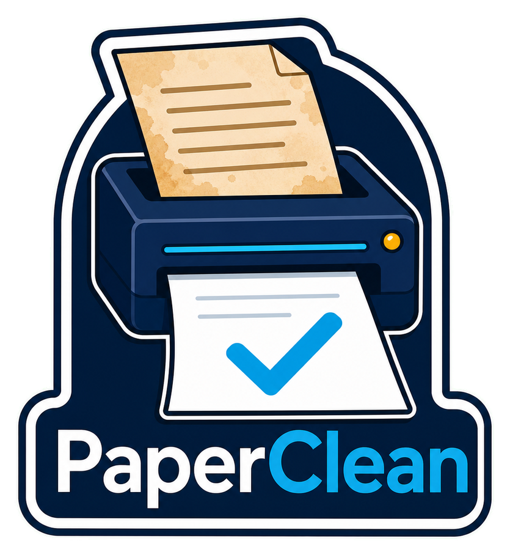
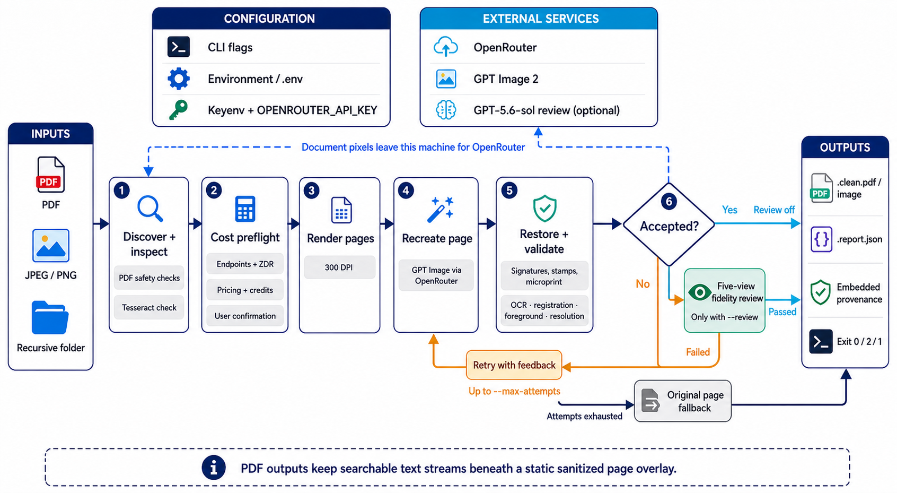

<div align="center">
  

  **🧹 Turn rough document photos into conservative, scanner-like files. 🧹**
</div>

PaperClean is a Python CLI for people who need cleaner PDFs or images from phone
photos and poor scans without silently accepting changed content. Give it a PDF,
JPEG, PNG, or folder; it recreates each page, runs local safety checks, requires
mandatory model verification, and falls back to the original page when a candidate
cannot be trusted.

Complete page pixels are sent through the configured backend: OpenRouter, or a
loopback AgentBridge server backed by your authenticated Codex CLI. Before work
begins, PaperClean shows a preflight and asks for confirmation. OpenRouter mode
includes live cost and credit checks; AgentBridge mode shows model-call ceilings
because Codex subscription USD usage is not exposed. Every generated page must pass
local geometry and foreground checks plus five-view multimodal fidelity verification.

## Install

PaperClean requires Python 3.11 or newer. Keyenv is recommended on macOS:

```bash
uv tool install keyenv-macos
uv tool install paperclean-cli
```

The PyPI distribution is named `paperclean-cli`; it installs the `paperclean`
command and Python package.

Keyenv is the recommended way to keep `OPENROUTER_API_KEY` in the macOS
Keychain. Create `~/.config/keyenv/.keyenv.toml`:

```toml
[keyenv]
version = 1

[secrets.OPENROUTER_API_KEY]
account = "paperclean-user/OPENROUTER_API_KEY"
required = true
```

Authorize and store the key:

```bash
cd ~/.config/keyenv
keyenv authorize OPENROUTER_API_KEY
keyenv set OPENROUTER_API_KEY
keyenv doctor
```

Run PaperClean from the directory containing your document:

```bash
paperclean document.pdf
```

To run generation and mandatory verification through Codex instead, start the sibling
AgentBridge checkout and select its backend. No OpenRouter key is needed:

```bash
cd ../agentbridge
uv run agentbridge

# In another terminal, from the directory containing the document:
paperclean document.pdf --backend agentbridge --yes
```

## Commands

```bash
paperclean document.pdf                         # clean one PDF
paperclean photo.jpg                            # clean one JPEG or PNG
paperclean scans/                               # recursively clean a directory
paperclean document.pdf --backend agentbridge   # use Codex through local AgentBridge
paperclean document.pdf --max-attempts 3        # set generation attempts per page
paperclean document.pdf --max-cost-usd 1.00     # set a soft observed-cost ceiling
paperclean document.pdf --review-model openai/gpt-5.6-sol  # select verifier
paperclean --help                               # show every CLI option
```

A source named `document.pdf` produces:

```text
document.clean.pdf
document.clean.pdf.report.json
```

Exit status `0` means every page passed, `2` means one or more original pages
were used, and `1` means a fatal file or batch failure.

## Configuration

CLI flags override environment variables, which override these defaults:

| Environment variable | Default |
| --- | --- |
| `PAPERCLEAN_BACKEND` | `openrouter` |
| `OPENROUTER_BASE_URL` | `https://openrouter.ai/api/v1` |
| `PAPERCLEAN_AGENTBRIDGE_BASE_URL` | `http://127.0.0.1:8082/api/v1` |
| `PAPERCLEAN_AGENTBRIDGE_TIMEOUT` | `660` |
| `PAPERCLEAN_IMAGE_MODEL` | `openai/gpt-image-2` |
| `PAPERCLEAN_REVIEW_MODEL` | `openai/gpt-5.6-sol` |
| `PAPERCLEAN_MAX_ATTEMPTS` | `3` |
| `PAPERCLEAN_JOBS` | `1` |
| `PAPERCLEAN_MAX_COST_USD` | unset |
| `PAPERCLEAN_ZDR` | `false` |

`OPENROUTER_API_KEY` is required only for the default OpenRouter backend.
AgentBridge defaults both models to `codex/gpt-5.6-sol`, requires a loopback URL,
and does not support `--max-cost-usd` or `--zdr`. PaperClean reads supported
values from the process environment first, then user-level `.env` or Keyenv
configuration, then repository-level configuration.

## Notes

- Supported inputs are PDF, JPEG, and PNG. Directory traversal is recursive and
  does not follow directory symlinks.
- Local registration, foreground, canvas, and resolution checks run before mandatory
  five-view model verification. Rejected candidates retry with feedback, then fall
  back to a source-preserving white-paper cleanup that must pass the same verification.
  A page-scoped review timeout is retried exactly once before that attempt fails closed.
  That recovery confirms every rejection once. Confirmed scanner-quality failures still
  veto publication; only expected global deskew/layout rectification and conservatively
  preserved source uncertainty are tolerated. Explicit missing,
  cropped, invented, text, table, and diagram discrepancies still fail closed; localized
  normalized source evidence is restored for text-like discrepancies and the candidate is
  reviewed again. The untouched original page is used only if recovery still fails.
- PaperClean restores registered reviewer-identified text, tables, diagrams, layout,
  signatures, stamps, and edge content from cleaned source pixels without restoring
  stains, skew, shadows, or damaged edges. Large photographic and diagnostic-image
  panels and large shaded form regions remain pixel-exact while the surrounding scanned
  paper is cleaned, even when thin scan noise connects a panel to a page border. A binder
  hole and its halo are erased
  directly only when their surrounding context is blank. When a hole obscures
  authored ink, PaperClean attempts a localized model restoration only when the obscured
  continuation is highly probable and publishes it only after independent full-page and
  regional verification. Vague unresolved-content alerts reject assisted restoration;
  otherwise the original hole is retained instead of guessing.
  A `changed_diagram` review alert is tolerable only when the local detector confirms
  that large photographic panels were masked and preserved by this deterministic path.
- The cost preflight checks selected endpoints, live pricing, available credits,
  and the conservative recovery ceiling. `--yes` accepts the displayed
  preflight but never overrides insufficient known credits.
- The AgentBridge preflight verifies Codex availability, authentication, native
  image generation, strict JSON Schema output, and both selected models. It shows
  conservative call counts and records observable orchestration tokens, but
  does not invent a USD cost or Codex subscription balance.
- `--max-cost-usd` is a soft ceiling. One completed request or an ambiguously
  billed timeout can exceed it.
- `--zdr` works only when every selected model endpoint is listed by OpenRouter
  as zero-data-retention capable. Do not process documents whose external
  transmission is prohibited.
- AgentBridge requests use `store: false`. Its strict Codex profile disables
  execution tools, treats page pixels as untrusted data, validates the returned
  raster, and removes request-scoped generated-image artifacts. Page pixels are
  still transmitted to the Codex service; do not process documents whose
  external transmission is prohibited.
- PDF outputs keep searchable text streams beneath an opaque page overlay.
  Active content and attachments are removed; encrypted PDFs, unapplied
  redactions, XFA, JavaScript-driven forms, and calculation-driven forms are
  rejected.

## Development

```bash
uv sync --frozen --all-groups   # install the locked development environment
uv run ruff check .             # lint
uv run mypy -p paperclean       # type-check
uv run pytest                   # run the offline test suite
uv build --no-sources           # build wheel and source distribution
keyenv run -- uv run pytest -m live  # run opt-in live tests
```

## Architecture



## License

No license file has been added yet.
